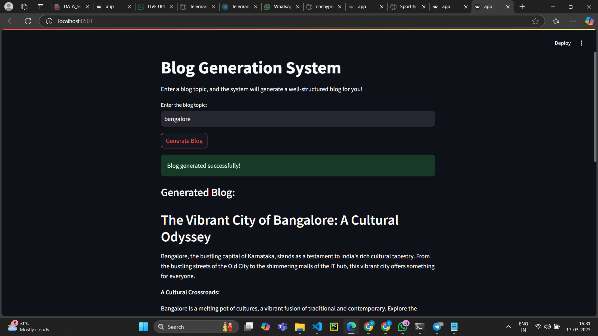
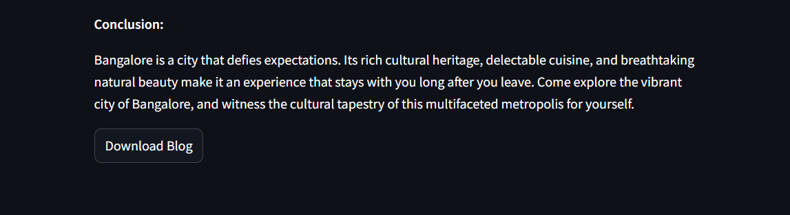

# Blog Generation System

## Overview

This project is a Blog Generation System that utilizes Streamlit and Ollama to generate blog content based on user input. It leverages the `gemma:2b` model and external resources like Wikipedia and DuckDuckGo search to enhance content generation.


## **Features**
- **Blog Generation**: Generates a blog with the following sections:
  - Heading
  - Introduction
  - Content
  - Summary
- **Research Tools**: Uses DuckDuckGo Search and Wikipedia to gather information.
- **Streamlit Interface**: Provides a simple web interface for users to input a topic and view the generated blog.
- **Download Option**: Allows users to download the generated blog as a `.txt` file.
---

## output images







---

## **Requirements**
To run this project, you need the following:

1. **Python 3.8 or later**
2. **Ollama**: A lightweight framework for running large language models locally.
3. **Streamlit**: For the web interface.
4. **LangChain**: For integrating the language model and tools.
5. **Additional Libraries**: `duckduckgo-search`, `wikipedia-api`, etc.

---

## Installation and Setup

### Step 1: Install Ollama

Download and install Ollama from the official website: [Ollama](https://ollama.com/).

### Step 2: Pull the Gemma Model

Run the following command to download the `gemma:2b` model in ollama application:

```bash
ollama pull gemma:2b
```

### Step 3: Install Required Libraries

Install the necessary Python dependencies using pip:

```bash
pip install -r requirements.txt
```

## Running the Project

### Start the Ollama Server

Ensure the Ollama server is running in the background before launching the application:

```bash
ollama serve
```

### Run the Streamlit App

Navigate to the project directory and run the Streamlit app using:

```bash
streamlit run app.py
```

### Use the App

1. Open the URL displayed in the terminal (usually [http://localhost:8501](http://localhost:8501)).
2. Enter a blog topic in the input field and click **Generate Blog**.
3. View the generated blog and download it using the **Download Blog** button.

## you can download blog

```bash
download.txt
```

## Project Structure

```
blog-generation-system/
├── app.py                               # Main Streamlit app code
├── README.md                            # Project documentation
└── requirements.txt                     # List of dependencies
```

## output 

##  **Exploring the Vibrant City of Bangalore**

**Introduction:**
Bangalore, the bustling capital of the southern state of Karnataka, is a city that embodies the spirit of India. From its ancient heritage to its modern cosmopolitan vibes, Bangalore offers a captivating experience for every traveler. This vibrant city is a melting pot of cultures, religions, and traditions, making it a destination that will leave you spellbound.

**Key Points:**

* **Cultural Heritage:** Explore the rich cultural heritage of Bangalore through its ancient temples, museums, and art forms. Visit the majestic Bangalore Palace, the magnificent Mysore Palace, and the intriguing ISKCON Temple.

* **Modernity and Culture:** Discover the bustling urban landscape of Bangalore, with its towering skyscrapers, shopping malls, and entertainment hubs. The city is also home to numerous cultural events, including the Bangalore International Film Festival and the Bangalore Literature Festival.

* **Natural Beauty:** Step into nature and immerse yourself in the scenic beauty of Bangalore. Visit the Lalbagh Botanical Garden, the Indira Gandhi National Park, and the Kemmangundi Hills for breathtaking landscapes and wildlife encounters.

**Conclusion:**
Bangalore is a city that offers a delightful blend of history, culture, and modernity. Whether you're seeking spiritual solace, a cultural immersion, or an escape into nature, Bangalore has something for you. From its ancient temples to its modern museums and parks, this vibrant city will leave you with unforgettable memories.


## License

This project is open-source and available under the [MIT License](LICENSE).

## Contributing

Feel free to contribute by submitting pull requests or reporting issues.

